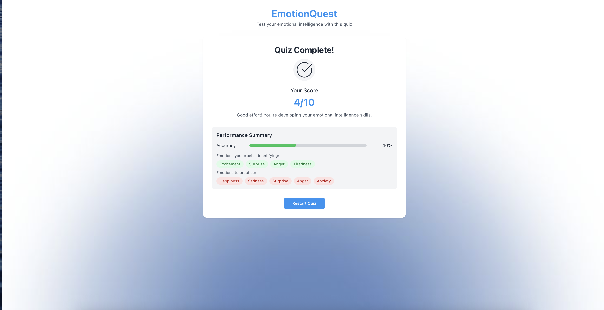

# 🧠 EmotionQuest - Emotional Intelligence Quiz

<div align="center">
  <p><strong>Test and grow your emotional intelligence with a fun, interactive quiz!</strong></p>
</div>

EmotionQuest is a modern, intuitive web app that challenges you to recognize emotions from emoji and sentences. Built with React, TypeScript, and Tailwind CSS, it features a beautiful custom background and a clean, responsive UI.

<div align="center">
  
  
</div>
---

## ✨ Features
- Emotion Quiz: Identify emotions from emoji and real-life sentences.
- Instant Feedback: See your score and get feedback after each question.
- Custom Background: Unique, visually appealing background image.
- Responsive Design: Works great on desktop and mobile.
- Performance Summary: See which emotions you excel at and which to practice.

## 🛠️ Tech Stack
- React 18 - UI Library
- ypeScript - Type Safety
- Vite - Build Tool
- Tailwind CSS - Styling
- Radix UI - Accessible Components
- Framer Motion - Animations
- React Query - Data Fetching


## 🚀 Getting Started

### Prerequisites
- Node.js (v16 or higher)
- npm

### Installation
1. Clone the repository
```bash
git clone https://github.com/06sarv/emotionquest.git
cd emotionquest
```

2. Install dependencies
```bash
npm install
# or
yarn install
```
3. Start the development server
```bash
npm run dev
# or
yarn dev
```
4. Build for production
```bash
npm run build
# or
yarn build
```

## 🎯 Usage

1. **Start the app and take the quiz**
2. **Select the emotion you think matches each emoji or sentence**
3. **Get instant feedback and see your results at the end**

---

## 🤝 Contributing

Contributions are welcome! Please feel free to submit a Pull Request. For major changes, open an issue first to discuss what you would like to change.

1. Fork the repository
2. Create your feature branch (`git checkout -b feature/amazing-feature`)
3. Commit your changes (`git commit -m 'Add some amazing feature'`)
4. Push to the branch (`git push origin feature/amazing-feature`)
5. Open a Pull Request

---

## 📝 License

This project is licensed under the MIT License - see the [LICENSE](LICENSE) file for details.

---

<div align="center">
  <strong>Made with ❤️ by Sarvagna</strong>
</div>